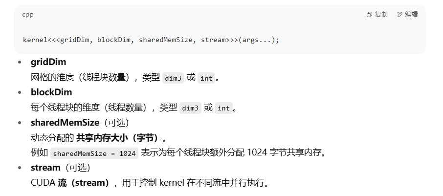

# 其他

`__syncthreads()` 是 CUDA 中的线程同步函数，用于在同一个线程块（block）内同步所有线程的执行进度。

## 作用
- 保证同一个 block 内所有线程执行到该点后，才会继续往下执行。
- 常用于共享内存（shared memory）操作，确保数据写入后再被其他线程读取。

## 使用场景
1. 共享内存数据交换
2. 分阶段的并行计算
3. 防止数据竞争和未定义行为

## 示例
```cpp
__global__ void kernel(float* data) {
	__shared__ float buf[256];
	int tid = threadIdx.x;
	buf[tid] = data[tid];
	__syncthreads(); // 等待所有线程写入完成
	// 下面可以安全地读取 buf 中所有数据
}
```

## 注意事项
- 只能用于 device 代码，且仅作用于 block 内线程。
- 不同 block 之间不能用 __syncthreads() 同步。
- 若 block 内部分线程提前 return，需保证所有线程都能执行到 __syncthreads()，否则会导致死锁。

---

合理使用 `__syncthreads()` 可避免并行程序中的数据竞争和同步问题，是 CUDA 编程的重要同步原语。

## 执行配置
