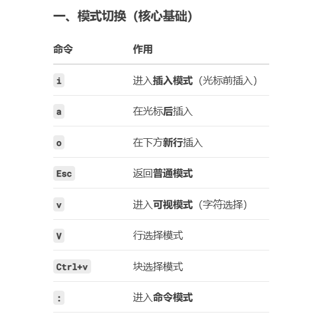
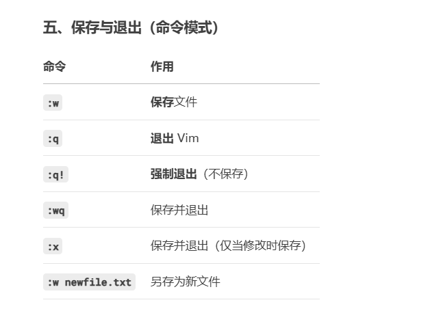

# bash 命令行的学习

windows上使用bash，直接安装git就行，默认配置安装，在vs code 的Terminate，里面就有一个 git bash

## 1.显示当前工作目录
```
pwd
```

## 2.VIM的使用





[lianjie](index.md)
## 3. 检查当前目录权限
```
ls -ld .
```

## 4.删除文件
```
rm -r my_folder #~~删除文件夹~~
```