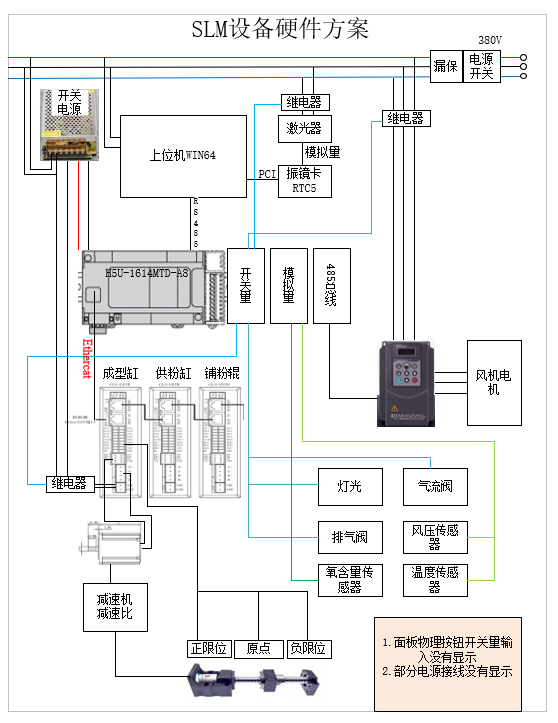
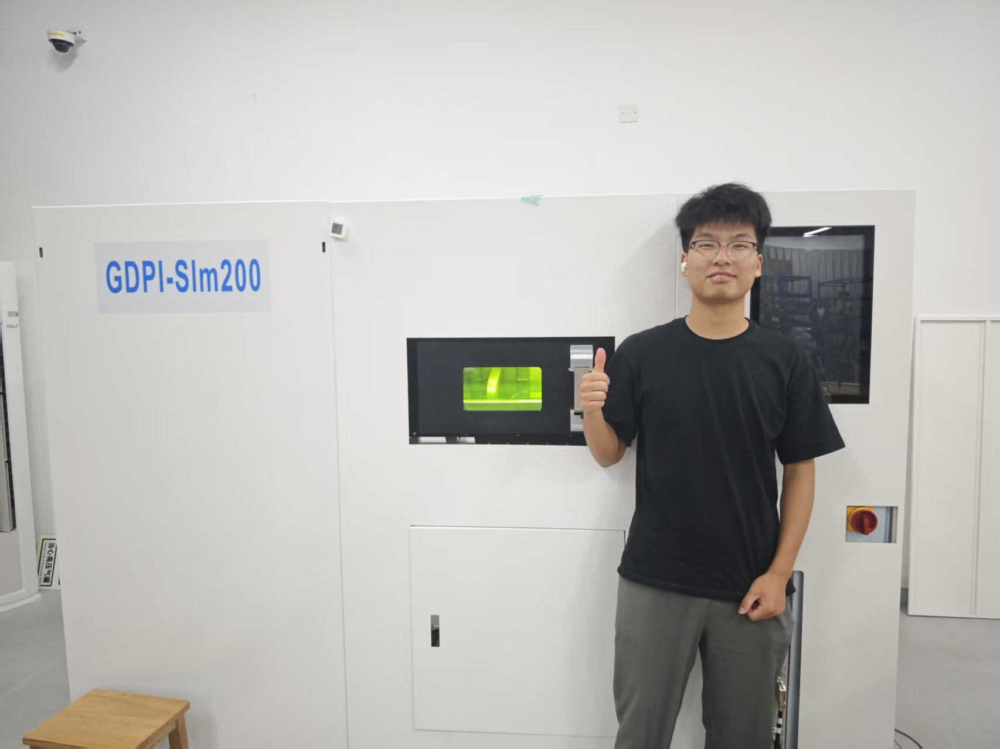
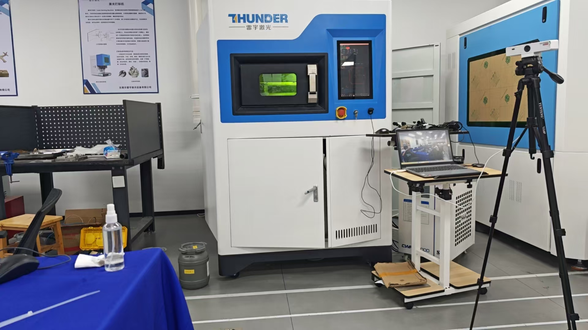
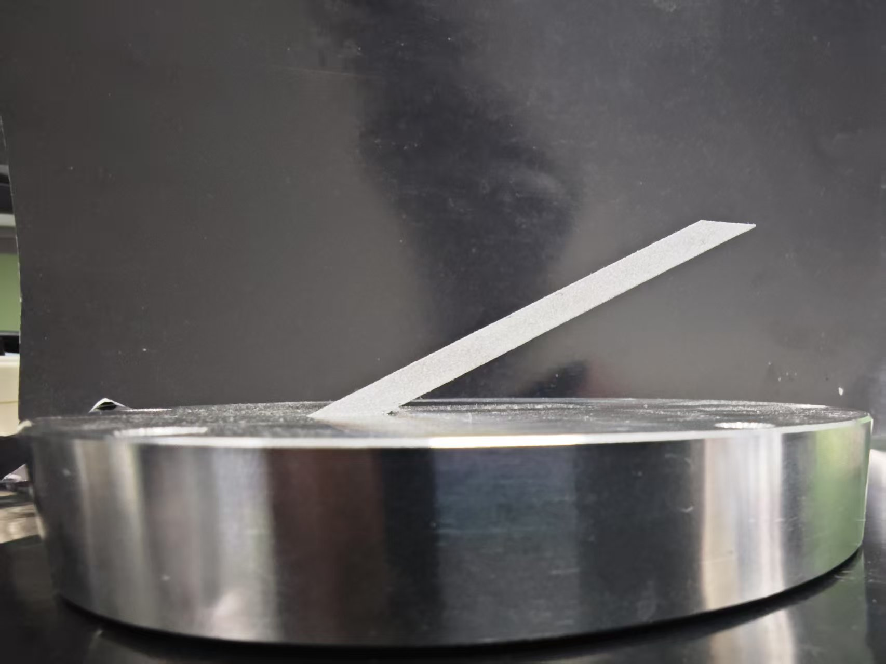
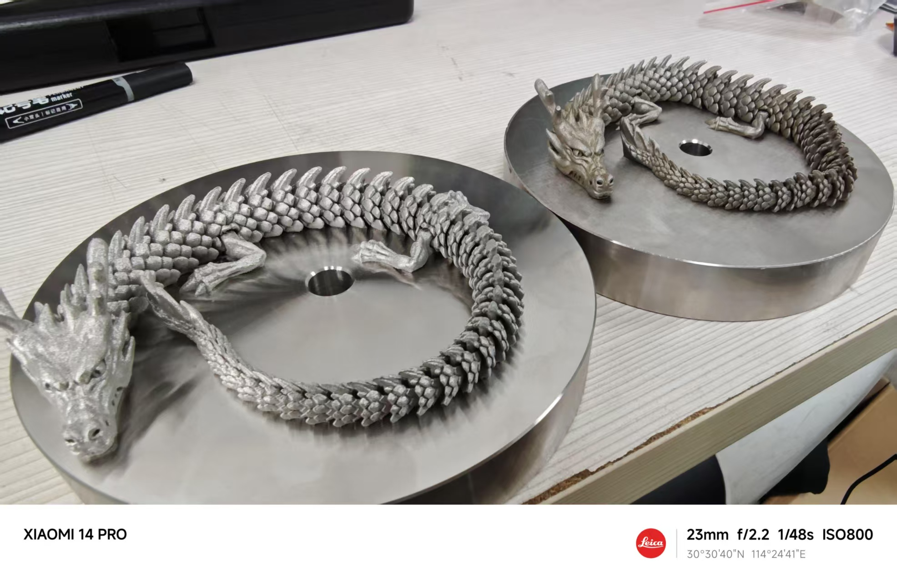
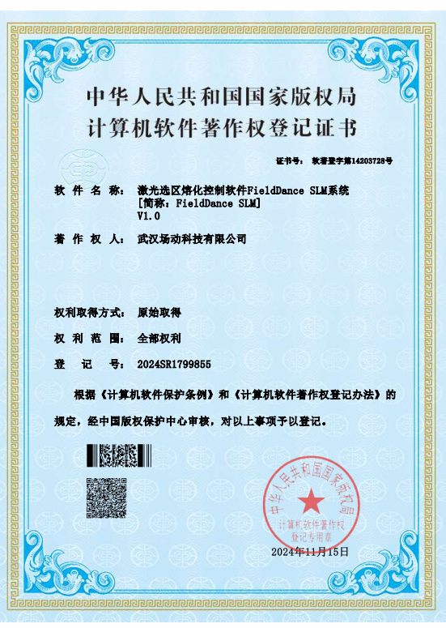

# AmazingAM

## 项目概述
为了解决增加制造过程中，零件因加工成程中翘曲变形，加工后力学性能差和表面粗糙度差等问题，决心自上位机软件，直接控制主轴的移动和振镜的路劲规划，以实现加工过程的全量控制，保证加工零件的品质。

## 项目意义

## 关键问题
- 1.历史遗留项目的Modbus通讯不稳定，需要更为合理的线程调度方案，解决运动时间不稳定的问题
- 2.需要更为合理的多激光路径规划算法，已实现更高的打印效率和质量
- 3.需要一个用户友好的交互界面，让实际超级人员更为方便的启动打印和配置参数
- 4.更加快速的视觉矫正方案

## 硬件拓扑图

## 软件核心功能

| 功能类别         | 关键特性                                                                 | 核心优势                                                                 |
|------------------|--------------------------------------------------------------------------|--------------------------------------------------------------------------|
| **能力调整**     | - 自动识别0-90°悬垂区 - 打印能量自适应优化                            | - 提升悬垂区表面质量 - 减少支撑添加量及角度需求                       |
| **断电续打**     | - 故障/断电后重启继续打印                                                | - 保障打印连续性                                                         |
| **大文件处理**   | - GB级文件快速载入                                                       | - 高效处理大型设计文件                                                   |
| **逆风打印**     | - 全局逆风路径规划                                                       | - 减少粉尘飞溅影响                                                       |
| **模拟仿真**     | - 实时显示当前层2D切片 - 显示已打印区域3D实体                         | - 可视化监控打印过程                                                     |
| **一键打印**     | - 全自动无干预启动                                                       | - 简化操作流程                                                           |
| **权限管理**     | - 多级操作权限（运行/调试/维护）                                         | - 保障设备操作安全                                                       |
| **参数监控**     | - 温度/压力/风速/含氧量 - 基板温度/机构位置                           | - 全面掌握设备运行状态                                                   |
| **数据记录**     | - 全程记录操作/运行/故障数据                                             | - 完整追溯打印过程                                                       |
| **自适应辅粉**   | - 按打印量自动调整供粉                                                   | - 减少30%+粉末消耗                                                       |
| **工艺管理**     | - 材料参数数据库 - 快速载入参数包                                     | - 标准化工艺管理                                                         |
| **多激光避让**   | - 振镜公共区智能避让                                                     | - 防止激光交叉干涉                                                       |
| **避烟优化**     | - 黑烟区域激光自动避让                                                   | - 确保激光束不受污染                                                     |
| **负载均衡**     | - 优化各激光扫描时间                                                     | - 提升多激光打印效率                                                     |
| **路径模式**     | - 填充/轮廓/表面扫描 - 智能生成最优路径                               | - 按需求优化（质量/效率优先）                                            |
| **变速辅粉**     | - 变速辅粉控制 - 边辅粉边打印                                         | - 提升整体打印效率                                                       |

## 项目成果

**装机现场**

**样品展示**

**软件著作**

