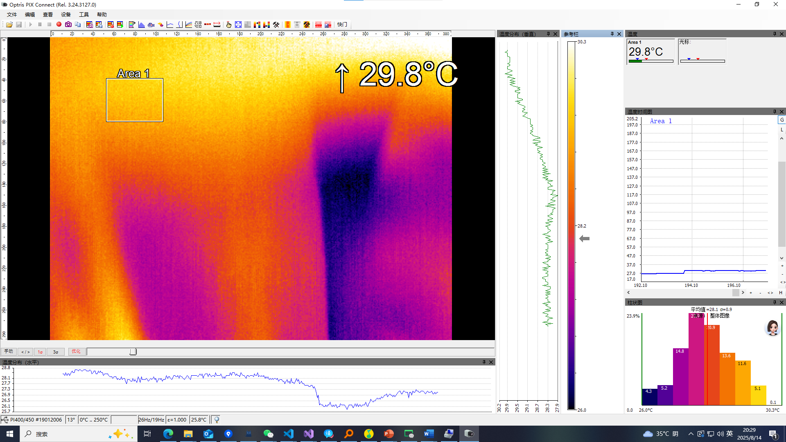

# 热像仪的使用

## 安装使用
- windows操作系统
- 下载软件：https://www.optris-ir.cn/software/pixconnect/
- 热成像仪连接任意USB串口

## SDK二次开发

### 预期目标
- 可以接受接触拍照信号
- 可以延时拍照或者拍视频
- 自动文件管理

### 技术路线
- 进程通讯-MQ-接受触发信号及相关参数

### 食用方法

**初始化**

**拍照或者截图**

**关闭**