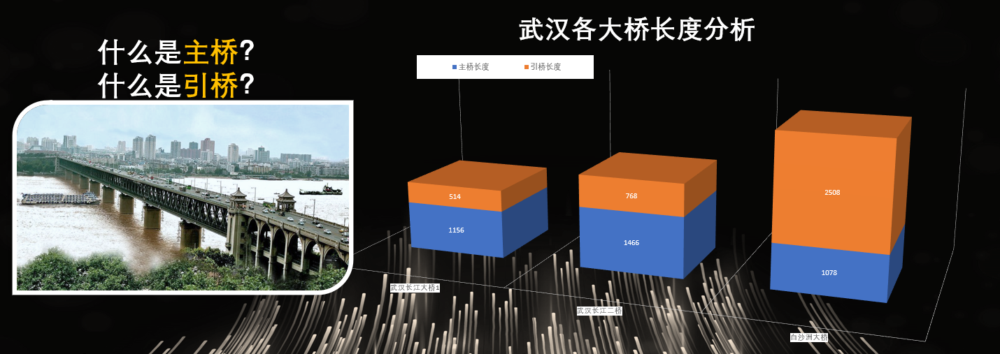

# 第六届钢结构桥梁设计大赛项目介绍

## 项目名称
**新型螺旋引桥式跨江大桥设计方案**

## 项目背景
在传统桥梁设计中，引桥往往存在以下问题：
1. 浪费建筑材料  
2. 占用大量宝贵土地资源
   

以武汉长江大桥为例，引桥所占土地造价极高（示例：地价估算可达约 2 亿元）。

## 解决方案：螺旋引桥 + 一体式桥墩
### 设计效果

### 设计特点
- **螺旋引桥**：采用圆周型螺旋线走向，整整三圈，坡度约为 7°，长度为 `3 × 20 × π` 米。
- **一体式桥墩桥梁**：顺应现代建桥趋势，结构简洁、强度可靠。
- **主桥面**：双向两车道 + 两侧施工人行通道，满足通行与维护需求。
- **斜拉索结构**：20 根巨型拉索提升结构稳定性与承重力。
- **桥面高度**：20 米。

### 占地面积对比（引桥部分）
| 类型           | 占地面积     |
|----------------|--------------|
| 传统直线引桥   | 16896 m²     |
| 新型螺旋引桥   | 1368 m²      |

## 结构性能分析
- **桥面受 1000N 压力的位移分析图**  
- **桥面受 1000N 压力的应力分布图**  
- **桥面受 100N 拉力的应力分布图**  

## 实现技术
- **新一代 3D 打印技术**：提升模型制作速度，操作更加简单、舒适。
- **CAD 精准制图**：支持结构设计与分析。
- **有限元应力分析**：确保设计的可靠性和安全性。

## 驾乘体验优化
- 螺旋结构使驾驶员“只需打一次方向盘”，行驶体验顺畅。
- 设计充分考虑坡度、转弯半径与可视距离，确保安全与舒适。

## 现实案例借鉴
- 融侨半岛立交桥  
- 停车楼螺旋坡道  
- 重庆苏家坝立交桥  

## 结语
我们的设计并非天马行空，而是融合了工程实践、交通流线、人因设计与结构创新。每一项细节，都是为了**更高效的空间利用、更舒适的通行体验、更前沿的结构美学**。

## 项目成员
- 创意来源：张腾，周鹏航  
- CAD 制图：顾东升  
- 3D 打印制作：周鹏航，顾东升  
- 应力分析：顾东升，张腾  
- PPT 制作：张腾  
- 资料收集：甘茁成，刘启来  

