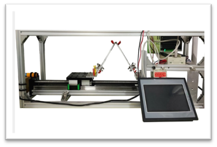

# 面向柔性电子的原位力学检测仪器开发预研

## 一、项目摘要

随着柔性电子的研究热潮，国内对柔性电子器件的性能检测需求日益增长，尤其在力学性能测试方面，目前国内设备多依赖国外进口，成本高昂，功能不完善。  
本项目旨在开发一款多功能集成的柔性电子原位力学检测仪，结合原位力学测试、可变热场与电阻检测三项功能，满足研究人员在实验中对实时多参数测试的需求，提升实验效率与数据可靠性。

---

## 二、项目目标与内容

### 研究目标
解决目前实验中难以**同步检测电、热、力学性能数据**的问题，提升测试效率与数据可靠性。

### 研究内容与关键问题
- 改装原有的多功能电子试验机；
- 集成电阻探针与耦合热应力分析模块；
- 实现**电学参数、温度场与力学行为**的同步检测；
- 熟悉机电控制原理、设备集成与调试流程。

---

## 三、研究方法与技术路线

1. **理论准备**：学习文献、验证可行性；
2. **器件选购**：合理控制成本，确保性能；
3. **设备组装**：结构设计 → 加工焊接 → 系统整合；
4. **调试实验**：柔性器件实测 → 数据验证；
5. **样机模型完成**。

---

## 四、项目可行性分析

- **技术可行性**：依托刘俐老师课题组，具备实验设备、环境与技术指导；
- **理论可行性**：多功能试验机原理成熟，部件来源广泛，控制系统方案可实现；
- **执行能力**：团队成员具备较强理论基础与实践能力。

---

## 五、项目创新点

> **升级研制一台集成力学、电学、热学测试于一体的多功能电子实验机。**

---

## 七、成果

- 一台具备完整功能的原型样机；
- 能够在实验中完成柔性电子器件的原位多参数性能检测；
- 为后续研究奠定设备基础。

---

## 八、附注

- 项目基于当前柔性电子行业测试设备空白，具有良好产业应用前景；
- 团队具有结构设计、部件整合与软件支持等多方面能力；
- 本项目为后续深入研究与设备国产化打下基础。

---

