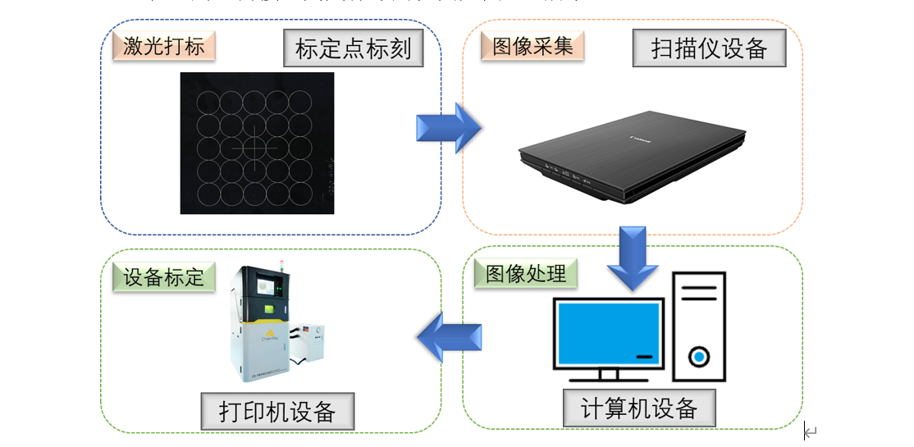

# 圆心识别算法分析

圆心识别算法主要用于在图像中自动检测和定位圆的中心点，常见于工业视觉检测、几何校正等场景。其分析过程通常包括以下几个关键步骤：

## 1. 边缘检测
首先对原始图像进行预处理（如去噪、灰度化），然后采用Canny等算法提取图像中的边缘信息。边缘检测的质量直接影响后续圆的识别效果。

## 2. 圆形轮廓提取
通过霍夫变换（Hough Circle Transform）等方法在边缘图中检测可能的圆形轮廓。该方法通过在参数空间内累加投票，寻找符合圆方程的像素点集合。

## 3. 圆心与半径估算
对检测到的圆形轮廓进行参数拟合，得到圆心坐标 (x, y) 和半径 r。常用的拟合方法包括最小二乘法等。

## 4. 精度优化与验证
对初步识别的圆心进行亚像素级优化（如使用梯度信息微调），并结合实际应用需求进行有效性验证（如剔除误检、筛选半径范围等）。

## 5. 结果输出
最终输出圆心坐标及半径信息，供后续视觉矫正或测量使用。

---

**算法流程图示意：**
1. 图像预处理 → 2. 边缘检测 → 3. 圆形检测（霍夫变换）→ 4. 圆心拟合与优化 → 5. 输出结果

**常见难点与对策：**
- 噪声干扰：需加强预处理和边缘检测的鲁棒性。
- 圆形不完整或有遮挡：可结合形态学处理或多尺度检测。
- 多圆干扰：需设置合理的参数筛选目标圆。

该算法在实际视觉矫正任务中，能够高效、准确地定位圆心，为后续的几何校正和测量提供可靠基础。
