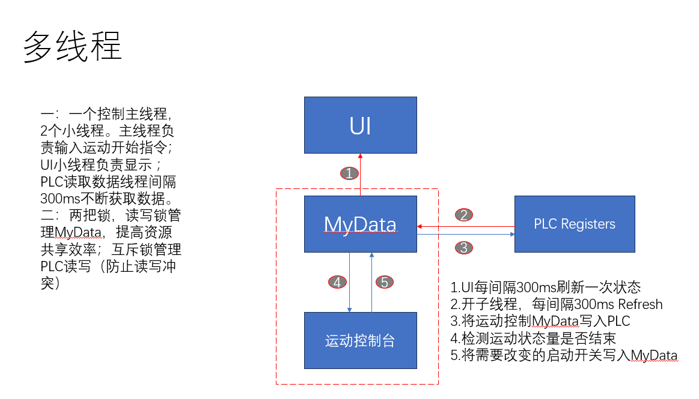
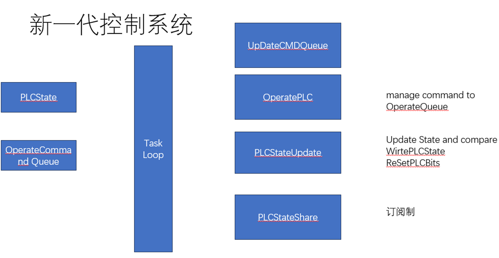

# 我的控制系统升级心得
读研期间，因课题组需要，写一款多轴控制系统的框架和具体实现，保证控制系统的高效性，可靠性和拓展性。

现在这款控制系统已经在几十台机器上运作了，如何PLC，控制卡制作成的大型工业设备
<!-- more -->
## 第一代控制系统

鉴于当时第一个做完成的代码开发，对于控制系统和软件开发都不熟悉，于是第一代控制系统的目标，是完成一个简单可靠的单线程控制台程序，通过命令行的形式远程电机的运动控制，状态查询。

现在想想，这个程序很简单，但是却为我之后的设计打下的坚实的基础。
过程中，我了解的串口通讯的知识（读写必须分开），测定单次小通讯和大通讯的速度，测定了电机运行加速度和速度的极限，制定了合适策略去避免运动轴过冲（脉冲控制的步进电机你懂的）。

这个控制程序没办法异步控制多个轴的运动，控制过程是阻塞的，每次控制要单独创建一个线程，去维护状态。数据的交换也是个问题，没有保障数据的线程安全。

不过还是有一些亮点的：

- 引入位实现硬件寄存器位的映射
- 引入中文变量减轻了英文变量的认知负担（但是编码也确实有点小问题，windows上的编码永远是个谜）

## 第二代控制系统

第二代控制系统主要是解决第一代的一些问题如：

- 数据传递
- 数据更新
- 多轴控制

对于核心数据，用上了一个读写锁来保证线程安全
UI这个时候就可以直接以引用传递的方式获取数据

对于数据的更新，建立一个线程定时推送更新指令

为了协调各个指令的先后关系，用队列将数据管理起来

对于多轴控制，因为许多运动开始的指令在同一个字节上，建立一个内存外部寄存器状态映射，确保数据的一致性。再创建一个线程单独对每个轴控制

亮点：

- 没啥亮点，就是稳定，一直在用
- 引入json对一些运动数据持久化，离线调试的时候再也不用一直拿着U盘跑来跑去了

## 第三控制系统

**目标：**

- 减少线程数量
- 严格控制数据交互,避免竞态

**预期**
