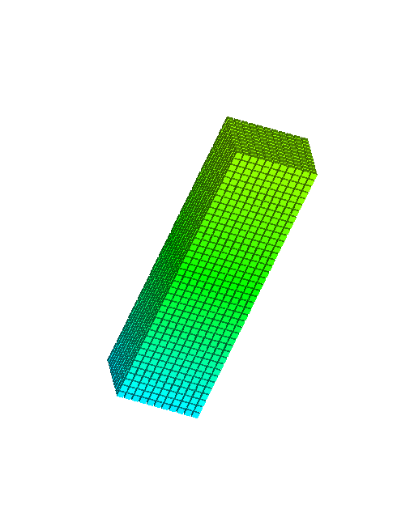

# 多线程比单线程更快吗？

多线程给人的第一直觉是单线程要快一些，耗时要短一些，因为毕竟有多个核心一起参与工作，相当于多增加了一些人手，但是现实真的是这样的？
<!-- more -->

## 实验验证

因为我最近在写传热学仿真的程序，里面涉及到大量的体素迭代，现在我就以此为例子



核心算子
```
voxel_cur[k][j][i].T = T_last + stabilty * (T_Up + T_Down + T_Left + T_Right + T_Front + T_Back - 6 * T_last);
```

**条件**

测量时间
```
auto start = std::chrono::high_resolution_clock::now();
auto end = std::chrono::high_resolution_clock::now();
auto duration = std::chrono::duration_cast<std::chrono::milliseconds>(end - start).count();
std::cout << "UpdateVoxelThreads took " << duration << " milliseconds." << std::endl;
```

- 计算次数:10000
- 计算层数：60
- intel i7-10700K,8核，3.8GHz，16个128位SIMD寄存器，最大内存带宽45.8 GB/s，
- 操作系统 window10 专业版 22H2

单线程
```C++
for (int k = 0; k <up_to_Z; k++) {
	for (int j = 0; j < y_size; j++) {
		for (int i = 0; i < x_size; i++) {
			
			if (voxel_cur[k][j][i].IsSolid) {
				//热传导

				float T_last = voxel_last[k][j][i].T;
				float stabilty = time_step * mp.GetThermalDiffusivity(T_last) / voxelsize / voxelsize;
				if (stabilty < 0 || stabilty>1) {
					std::cout << "stablity error occurs" << std::endl;
				}
				//采集stability
				if(distribution_stability.size())RecordFactor(stabilty);
				float T_Up = GetTemperature(i, j, k + 1, T_last, voxel_last);
				float T_Down = GetTemperature(i, j, k - 1, T_last, voxel_last);
				float T_Left = GetTemperature(i - 1, j, k, T_last, voxel_last);
				float T_Right = GetTemperature(i + 1, j, k, T_last, voxel_last);
				float T_Front = GetTemperature(i, j + 1, k, T_last, voxel_last);
				float T_Back = GetTemperature(i, j - 1, k, T_last, voxel_last);

				voxel_cur[k][j][i].T = T_last + stabilty * (T_Up + T_Down + T_Left + T_Right + T_Front + T_Back - 6 * T_last);
				if (voxel_cur[k][j][i].T  <20.f || voxel_cur[k][j][i].T  > mp.GetMeltingTemperature()) {
					std::cout << "error occurs" << std::endl;
				}
				//采集温度差的最大变化
				static float MaxDeltaTemp = INT_MIN;
				float curDelta= abs(voxel_cur[k][j][i].T - T_last);
				if (curDelta > 5)MaxDeltaCounter++;
				if (curDelta > MaxDeltaTemp) {
					std::cout << "iterations:" << iterations << "MaxDeltaTemperature: " << curDelta << std::endl;
					MaxDeltaTemp = curDelta;
				}
			}
		}
	}
}
```
- 多线程核数：4

多线程
```C++
int num_threads = std::thread::hardware_concurrency()/4;
int layers_per_thread = (up_to_Z + 1) / num_threads;
std::vector<std::future<void>> futures;

ThreadSafeVector<VoxelLayer>voxelLayers;
voxelLayers.reserve(up_to_Z+1);

//创建任务
if (up_to_Z + 1 <= num_threads) {
	for (int index_z = 0; index_z < up_to_Z; index_z++) {
		futures.emplace_back(
			std::async(std::launch::async, [index_z, this, &voxel_last, &voxelLayers] {
				ProcessLayer(index_z, voxel_last, voxelLayers);
				})
		);
	}
}
else {
	for (int t = 0; t < num_threads; t++) {
		int k_start = t * layers_per_thread;
		int k_end = (t == num_threads - 1) ? up_to_Z-1 : (k_start + layers_per_thread - 1);
		futures.emplace_back(
			std::async(std::launch::async, [&voxel_last, k_start, k_end,this,&voxelLayers] {
				for (int k = k_start; k <= k_end; k++) {
						ProcessLayer(k, voxel_last, voxelLayers);
				}
				})
		);
	}
}

//计算任务
for (auto& f : futures) {
	f.get();
}
futures.clear();

//收集结果
for (int i = 0; i < voxelLayers.size();i++) {
	voxel_cur[voxelLayers.get(i).first] = voxelLayers.get(i).second;
}
```
**SSE**
```Cpp
const __m128 v_zero = _mm_set1_ps(0.0f);
const __m128 v_one = _mm_set1_ps(1.0f);
const __m128 v_six = _mm_set1_ps(6.0f);
const __m128 v_twenty = _mm_set1_ps(20.0f);
const __m128 v_melt = _mm_set1_ps(mp.GetMeltingTemperature());
const float inv_h2 = 1.0f / (voxelsize * voxelsize);

static float MaxDeltaTemp = INT_MIN;

for (int k = 0; k < up_to_Z; k++) {
	for (int j = 0; j < y_size; j++) {
		int i = 0;
		for (; i + 3 < x_size; i += 4) {
			// 加载 T_last 向量
			__m128 vT_last = _mm_set_ps(
				voxel_last[k][j][i + 3].T,
				voxel_last[k][j][i + 2].T,
				voxel_last[k][j][i + 1].T,
				voxel_last[k][j][i + 0].T
			);

			// Solid mask
			__m128i solidMaskInt = _mm_set_epi32(
				voxel_cur[k][j][i + 3].IsSolid,
				voxel_cur[k][j][i + 2].IsSolid,
				voxel_cur[k][j][i + 1].IsSolid,
				voxel_cur[k][j][i + 0].IsSolid
			);
			__m128 solidMask = _mm_castsi128_ps(_mm_cmpeq_epi32(solidMaskInt, _mm_set1_epi32(1)));

			// 热扩散率 α
			__m128 vAlpha = _mm_set_ps(
				mp.GetThermalDiffusivity(voxel_last[k][j][i + 3].T),
				mp.GetThermalDiffusivity(voxel_last[k][j][i + 2].T),
				mp.GetThermalDiffusivity(voxel_last[k][j][i + 1].T),
				mp.GetThermalDiffusivity(voxel_last[k][j][i + 0].T)
			);

			__m128 vStab = _mm_mul_ps(_mm_set1_ps(time_step * inv_h2), vAlpha);

			// 邻居温度
			__m128 vUp = _mm_set_ps(
				GetTemperature(i + 3, j, k + 1, voxel_last[k][j][i + 3].T, voxel_last),
				GetTemperature(i + 2, j, k + 1, voxel_last[k][j][i + 2].T, voxel_last),
				GetTemperature(i + 1, j, k + 1, voxel_last[k][j][i + 1].T, voxel_last),
				GetTemperature(i + 0, j, k + 1, voxel_last[k][j][i + 0].T, voxel_last)
			);
			__m128 vDown = _mm_set_ps(
				GetTemperature(i + 3, j, k - 1, voxel_last[k][j][i + 3].T, voxel_last),
				GetTemperature(i + 2, j, k - 1, voxel_last[k][j][i + 2].T, voxel_last),
				GetTemperature(i + 1, j, k - 1, voxel_last[k][j][i + 1].T, voxel_last),
				GetTemperature(i + 0, j, k - 1, voxel_last[k][j][i + 0].T, voxel_last)
			);
			__m128 vLeft = _mm_set_ps(
				GetTemperature(i + 2, j, k, voxel_last[k][j][i + 3].T, voxel_last),
				GetTemperature(i + 1, j, k, voxel_last[k][j][i + 2].T, voxel_last),
				GetTemperature(i + 0, j, k, voxel_last[k][j][i + 1].T, voxel_last),
				GetTemperature(i - 1, j, k, voxel_last[k][j][i + 0].T, voxel_last)
			);
			__m128 vRight = _mm_set_ps(
				GetTemperature(i + 4, j, k, voxel_last[k][j][i + 3].T, voxel_last),
				GetTemperature(i + 3, j, k, voxel_last[k][j][i + 2].T, voxel_last),
				GetTemperature(i + 2, j, k, voxel_last[k][j][i + 1].T, voxel_last),
				GetTemperature(i + 1, j, k, voxel_last[k][j][i + 0].T, voxel_last)
			);
			__m128 vFront = _mm_set_ps(
				GetTemperature(i + 3, j + 1, k, voxel_last[k][j][i + 3].T, voxel_last),
				GetTemperature(i + 2, j + 1, k, voxel_last[k][j][i + 2].T, voxel_last),
				GetTemperature(i + 1, j + 1, k, voxel_last[k][j][i + 1].T, voxel_last),
				GetTemperature(i + 0, j + 1, k, voxel_last[k][j][i + 0].T, voxel_last)
			);
			__m128 vBack = _mm_set_ps(
				GetTemperature(i + 3, j - 1, k, voxel_last[k][j][i + 3].T, voxel_last),
				GetTemperature(i + 2, j - 1, k, voxel_last[k][j][i + 2].T, voxel_last),
				GetTemperature(i + 1, j - 1, k, voxel_last[k][j][i + 1].T, voxel_last),
				GetTemperature(i + 0, j - 1, k, voxel_last[k][j][i + 0].T, voxel_last)
			);

			// Laplacian
			__m128 vSum = _mm_add_ps(_mm_add_ps(vUp, vDown), _mm_add_ps(vLeft, vRight));
			vSum = _mm_add_ps(vSum, _mm_add_ps(vFront, vBack));
			__m128 vLap = _mm_sub_ps(vSum, _mm_mul_ps(v_six, vT_last));

			// T_new
			__m128 vT_new = _mm_add_ps(vT_last, _mm_mul_ps(vStab, vLap));
			
			// 写回
			float arr[4];
			_mm_storeu_ps(arr, vT_new); // 无需内存对齐要求

			voxel_cur[k][j][i + 0].T = arr[0];
			voxel_cur[k][j][i + 1].T = arr[1];
			voxel_cur[k][j][i + 2].T = arr[2];
			voxel_cur[k][j][i + 3].T = arr[3];

		}

		// 剩余尾部标量
		for (; i < x_size; i++) {
			if (!voxel_cur[k][j][i].IsSolid) continue;
			float T_last = voxel_last[k][j][i].T;
			float s = time_step * mp.GetThermalDiffusivity(T_last) / voxelsize / voxelsize;
			float T_up = GetTemperature(i, j, k + 1, T_last, voxel_last);
			float T_down = GetTemperature(i, j, k - 1, T_last, voxel_last);
			float T_left = GetTemperature(i - 1, j, k, T_last, voxel_last);
			float T_right = GetTemperature(i + 1, j, k, T_last, voxel_last);
			float T_front = GetTemperature(i, j + 1, k, T_last, voxel_last);
			float T_back = GetTemperature(i, j - 1, k, T_last, voxel_last);
			voxel_cur[k][j][i].T = T_last + s * (T_up + T_down + T_left + T_right + T_front + T_back - 6 * T_last);
		}
	}
}
```

**循环计算10000次结果**

|情况|时间耗时ms|
|---|---|
|SSE|1610|
|单线程|2710|
|多线程|2703|


## 继续分析

|多线程|时间耗时ms|
|---|---|
|任务的创建（deffered）|24|
|任务的执行|1638|
|结果的拷贝|1120|


**完整计算**

从第一层到最后一层，计算任务量线性增加

|情况|时间耗时s|
|---|---|
|SSE|77.92|
|单线程|100.82|
|多线程|172.53|

## 结果讨论

- 多线确实加速计算的速度，但是结果拷贝的开销也不小
- 主要开销，锁的开销，内存的复制
- 实践建议，任务计算时间最好远大于内存的复制开销
- SSE计算太快了吧，且还有优化空间

## 优化方向
- cuda并行计算，利用好1024个核心子线程，实现并行规约计算
- 深度优化多线程，降低锁的粒度
- 不使用vector，并将温度和标志位分别使用C风格的裸数组
