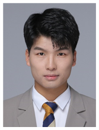

# 你好，我是张腾

  
  

    
🎓 材料加工硕士 | 💻 全栈开发者 | 🧠 人工智能爱好者

    
🌍 坐标：中国 · 武汉

    
📫 联系方式：<a href="mailto:zhang.teng520@hotmail.com">zhang.teng520@hotmail.com</a>

  

---

## 💡 关于我

我是一位专注于技术深度与系统设计的开发者，喜欢用代码表达创意，也热衷记录和分享学习过程。

我的技术方向包括：

- :material-border-radius: &#x20 &#x20嵌入式：PLC，STM32，ScanLab
- 🧠 人工智能：Cuda、Transformer、AIGC
- 🎮 图形开发：现代 OpenGL、GLSL、Clipper、OpenCV
- 🌐 UI框架：ImGui、QT、
- :simple-ultralytics:&#x20仿真：Ansys、
---

## 🛠️ 技术栈

- **语言**：C++、C、Python、java  
- **AI 工具**：Cursor、OpenAI API、DeepSeek、HunYuan  
- **开发环境**：Git、VSCode、Visual Studio
- **操作系统**：Windows、Unbuntu、Android  

---

## 📂 我的项目

- :material-car-emergency: **AmazingAM**  
  一款用于 __增材制作__ 的模型到成品的加工软件

- :simple-instructure: **AmazingCAE**  
  模拟加工过程中热行为

- :material-content-save-alert-outline: **激光毛化控制器**  
  多通道动态改变激光频率和占空比

- :material-vector-intersection: **视觉标定**  
  扫描仪低成本标定方案

---

## ✨ 信条

> “对对自己的定义为：`Problem Solver`”
>> “代码是工具，不是目的。创造是终点。”
>>> “要么不做，要做，就做最好！”
